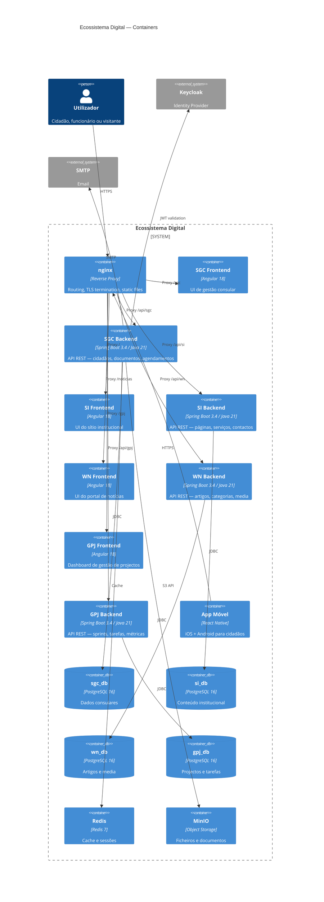

# C4 Container Diagram — Ecossistema Digital

Visão de containers técnicos e suas interacções.

## Containers

### Backends (Spring Boot 3.4 / Java 21)

| Container | Base de Dados | Porta | Descrição |
|-----------|--------------|-------|-----------|
| SGC Backend | sgc_db | 8081 | Gestão consular: cidadãos, documentos, agendamentos |
| SI Backend | si_db | 8082 | Sítio institucional: páginas, serviços |
| WN Backend | wn_db | 8083 | Notícias: artigos, categorias, media |
| GPJ Backend | gpj_db | 8084 | Projectos: sprints, tarefas, métricas |

Todos os backends dependem de `ecossistema-commons` (dto, security, audit, i18n).

### Frontends (Angular 18)

| Container | Rota nginx | Descrição |
|-----------|-----------|-----------|
| SGC Frontend | /sgc | Painel de gestão consular |
| SI Frontend | / | Sítio institucional público |
| WN Frontend | /noticias | Portal de notícias |
| GPJ Frontend | /gpj | Dashboard de projectos |

### Infraestrutura

| Container | Tecnologia | Função |
|-----------|-----------|--------|
| nginx | nginx 1.25 | Reverse proxy, TLS, routing |
| PostgreSQL | PostgreSQL 16 | 4 bases de dados isoladas |
| Redis | Redis 7 | Cache e sessões |
| MinIO | MinIO | Armazenamento de ficheiros |
| Keycloak | Keycloak 24 | Identity provider, SSO |
| MailHog | MailHog | SMTP mock (desenvolvimento) |
