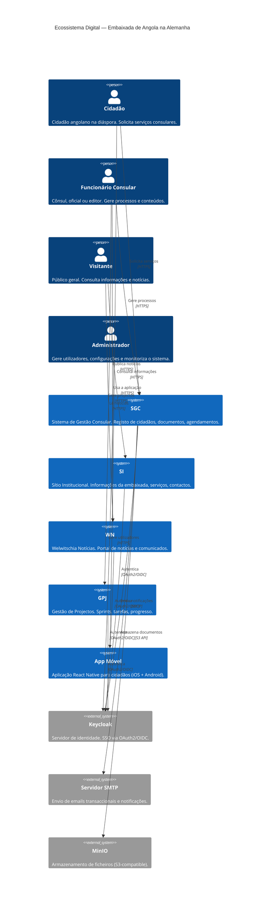

# C4 Context Diagram — Ecossistema Digital

Visão de contexto do sistema: actores externos e suas interacções com o ecossistema.

## Actores

| Actor | Descrição | Sistemas |
|-------|-----------|----------|
| Cidadão | Angolano na diáspora, solicita serviços consulares | SGC, App Móvel |
| Funcionário Consular | Cônsul, oficial, editor — gere processos e conteúdos | SGC, GPJ, WN |
| Visitante | Público geral, consulta informações | SI, WN |
| Administrador | Gere utilizadores e configurações do sistema | Keycloak, todos |

## Sistemas Externos

| Sistema | Função |
|---------|--------|
| Keycloak | Identity Provider — SSO, gestão de utilizadores e roles |
| SMTP (MailHog em dev) | Envio de emails transaccionais |
| MinIO | Armazenamento de ficheiros (documentos, imagens) |
